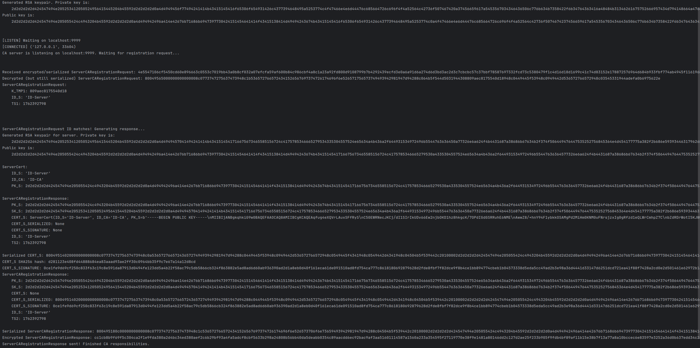
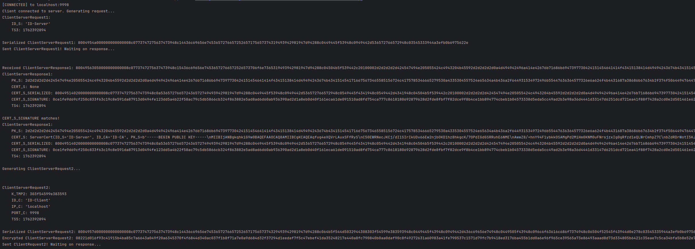
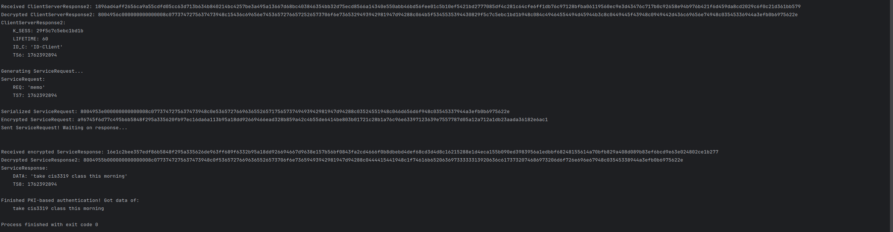
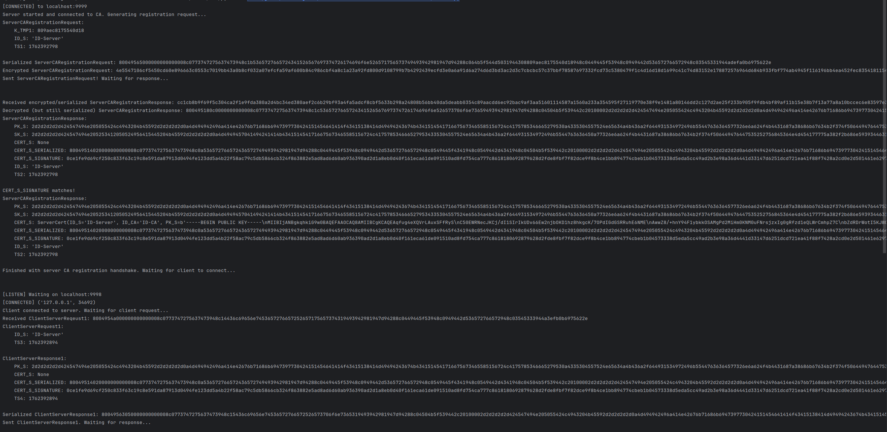
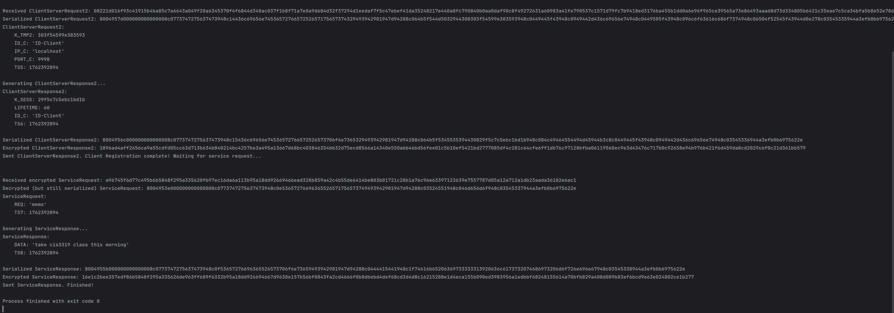
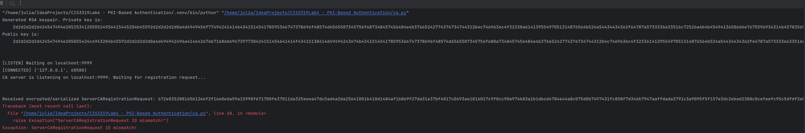
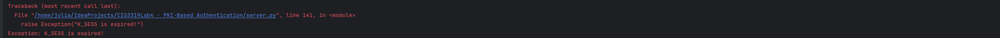
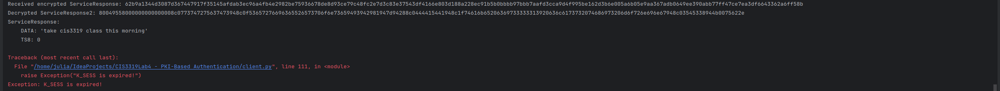

# Design
My implementation is structured similarly to the previous lab, where I used dataclasses that can be arbitrarily serialized
(then encrypted/signed, etc.) for network transmission.

To run it, just run `ca.py`, then `server.py` (so they can complete their handshake first), then `client.py`.

One problem I ran into early in was due to the dataclasses.
Previously, we had only serialized substructured dataclasses where the subclass is encrypted. This means that the chances of
the encrypted substructure containing the `utils.Constants.DELIM` is very low, so I chose to use the
[Ostrich Algorithm](https://en.wikipedia.org/wiki/Ostrich_algorithm) to deal with that potential bug. Now, we are
transmitting cleartext serialized substructures, so they will ALWAYS contain the same delimiter as the parent class.
This make serializing them with the means I was currently using impossible. I just used Python's `pickle` to get around
that, which is most likely what I should have done in the first place. I'm not really used to having so many utilities
available to me, and am used to writing my own low level solutions. Post-`pickle` implementation everything went super
smoothly, and I was able to knock out most of this assignment in a single evening.

# Testing
## Good run
### Good CA Run:

### Good Client Run:

### Good Server Run:

## Bad runs
### Bad ID_S in ServerCARegistrationRequest

### Bad TS in ServiceRequest

### Bad TS in ServiceResponse

